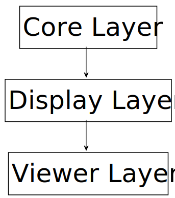
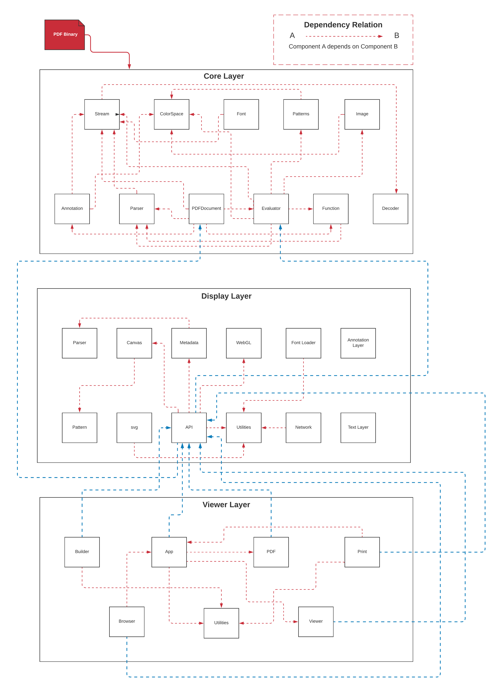
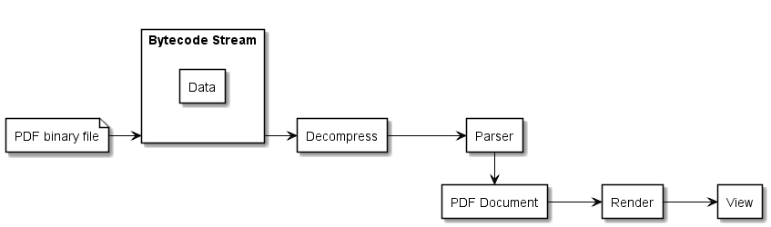
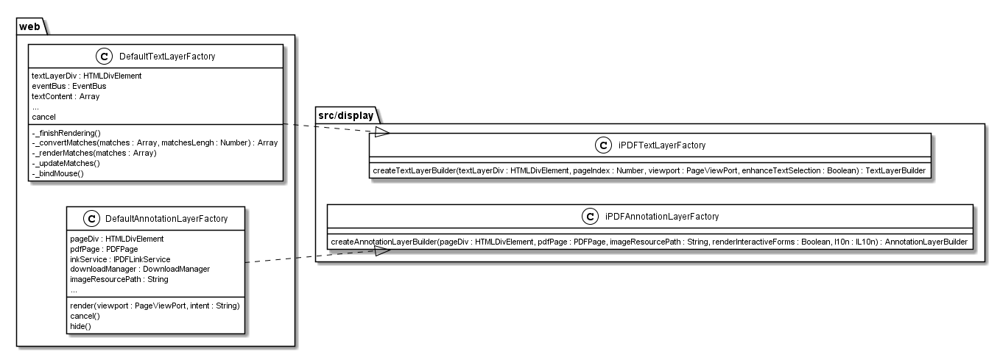
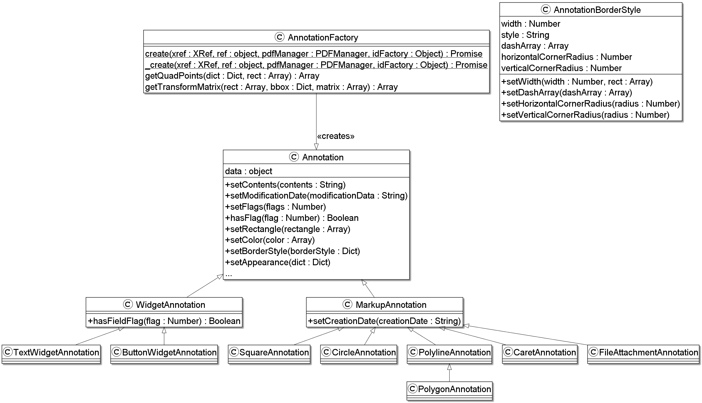

# PDF.js - Overall Architecture Revisited

PDF.js is a Portable Document Format(PDF) viewer that is built with HTML5, CSS and javascript. It is a community driven project with the main goal of being a general-purpose, web standards-based platform for parsing and rendering pdf files. It is directly built into Firefox version 19+ and it can be downloaded as an extension on browsers such as Google Chrome.

PDF.js’s overall architecture is made up of different layers and understanding each layer is key to understanding the overall project. PDF.js is split into three main layers, namely the Core, Display, and Viewer layer.

    

## Higher-level Diagram

    

PDF.js is a three layered architecture system. It starts with the core layer, then the display layer, then the viewer layer. Each layer has different components that have their own job in the overall system. Some components depend on other components, even components from different layers. Each subsequent layer depends upon the layers above it, i.e. the display layer depends on the core layer and the viewer layer depends on the display layer.

A basic activity flow of what's happening to the PDF in the system can be seen in the image below.

    

## Core [(src/core)](https://github.com/CSCD01-team32/pdf.js/blob/af8d0b9597ccd0e020910eafd74dd6ad140db520/src/core)

The core layer is the layer where a PDF in binary is parsed and interpreted. It is the foundation for all subsequent layers. It is located in the src/core folder. It has different files for interpreting and parsing PDF files. The core layer isn't used directly because it is too advanced so an api must be built for easier use.

## Display [(src/display)](https://github.com/CSCD01-team32/pdf.js/blob/af8d0b9597ccd0e020910eafd74dd6ad140db520/src/display)

The display layer takes the core layer and exposes an easier to use API to render PDFs and get other information out of a document. The display layer can be found in the src/display folder.

The main file in the display layer is the file called api.js. In this file there are classes that deal with rendering and proxy of a PDF document. A description of the classes can be seen in the table below.

| **Class** | **Description** |
|-------|-------------|
|PDFDocumentLoadingTask       |Controls the operations required to load a PDF document (such as network requests) and provides a way to listen for completion, after which individual pages can be rendered             |
|PDFDataRangeTransport       |Supports range requests             |
|PDFDocumentProxy       |A proxy to a PDFDocument|
|PDFPageProxy       |A proxy to a PDFPage in the worker thread             |
|PDFWorker       |PDF.js web worker abstraction, which controls the instantiation of PDF documents. Message handlers are used to pass information from the main thread to the worker thread and vice versa. If the creation of a web worker is not possible, a "fake" worker will be used instead.             |
|RenderTask       |Allows for control of the rendering tasks             |
|InternalRenderTask       |Internally used by RenderTask class             |

## Viewer [(web)](https://github.com/CSCD01-team32/pdf.js/blob/af8d0b9597ccd0e020910eafd74dd6ad140db520/web)

The viewer is built on the display layer and is the User Interface (UI) for PDF viewer in Firefox and the other browser extensions within the project. The viewer layer can be found in the web folder.

The viewer is just a regular HTML page. It is a rendered page that contains:

- A non-scaled canvas
- A text layer, which is an invisible 
 to store text for selection (UML class diagram can be seen below)
- An annotation layer than contains hyperlinks and notes (UML class diagram can be seen below)

    

## Design Patterns/Principles

### Factory Design Pattern

The Factory design pattern is a recurring pattern used for different classes in this project. For example, the file annotation.js in the src/core folder evidently uses the factory design pattern (see image below) for the creation of different types of annotation representations for a pdf.

    

### Facade Design Pattern

    <figure>
        
    </figure>

The Facade design pattern is used in the system. It is a structural design pattern that hides the complexities of the system and provides an easier to use interface for clients. Earlier, we mentioned that the core layer is too advanced to use directly, so an easier to use api must be created. In this case we would consider the facade as the api.

Other developers can use the api from the display layer, to help them build their own viewer. This can be done because you can download the a prebuilt version of pdf.js, which is exported by the file src/pdf.js. The prebuilt version can be downloaded from several CDNs. The prebuilt version can then be used by other developers to in the development of their own pdf viewer.

## Conclusion

The overall system is well designed, but there is a lot of code that is not well documented, so reading through some of the code and trying to understand what was going on was pretty difficult. We like how they used a shared folder for code that is used by both the core and display layer.

We liked how the project is split into layers, each layer having a specific role in the overall structure of the system, rather than just putting everything in one big folder.

We found it interesting that there were several ways to run the project. In the viewer layer there is a file called pdf.js that packages the project and creates a prebuilt version of the project that includes a generic build of PDF.js and the viewer, rather than just directly running it from the source code or downloading it as an extension for browsers like Google Chrome.
