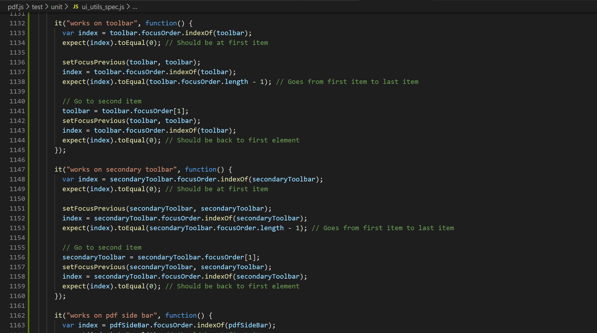
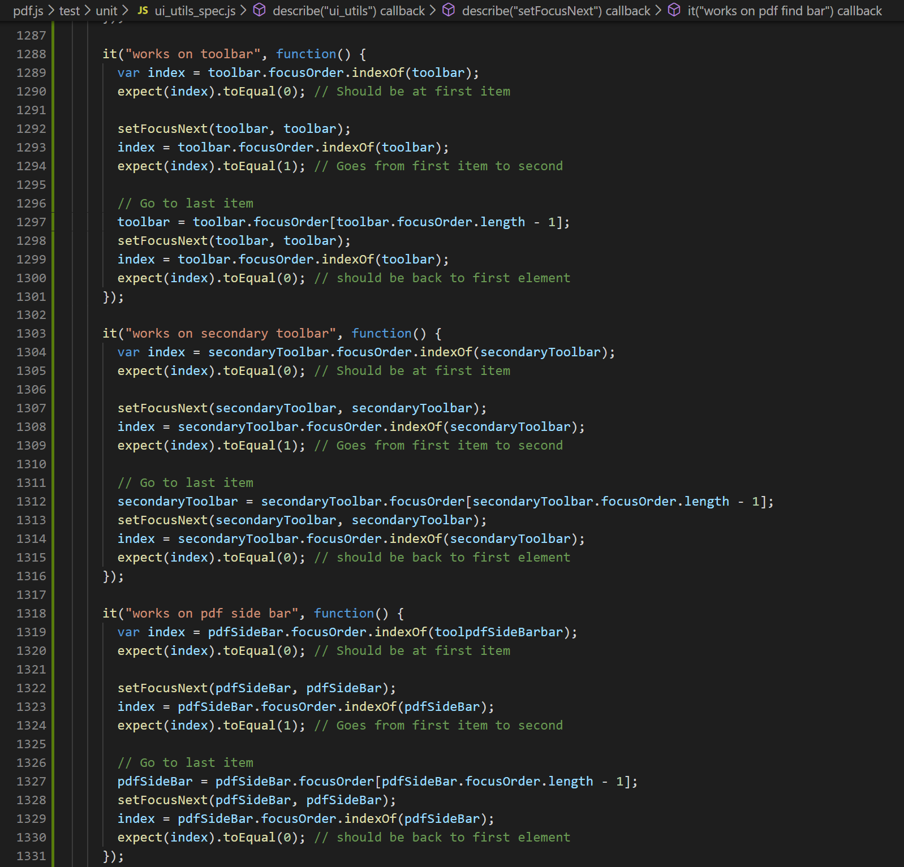

# Unit Test

The purpose of our unit test was to make sure that the arrow key functionality was working properly. PDF.js uses the jasmine unit testing framework to unit test their code.

We tested the two functions that we created in [ui_utils.js](https://github.com/CSCD01-team32/pdf.js/blob/toolbar-feature/web/ui_utils.js):

- setFocusPrevious
- setFocusNext

Fortunately for us, there was already a unit test file to unit test functions from the ui_utils.js file. We decided to add out unit tests to that file.

Unit tests can be found in the file [ui_utils_spec.js](https://github.com/CSCD01-team32/pdf.js/blob/toolbar-feature/test/unit/util_spec.js).

### 1. setFocusPrevious

The function *setFocusPrevious* sets the focus to the previous item in the toolbar. When unit testing for each of the four toolbars, we decided to make sure the focus would start at the first item. Then we tested to make sure that if we call setFocusPrevious while the focus is on the first item, that the focus changes to the last item, to make the arrow key functionality circular. Lastly, we just tested to make sure that the focus goes to the previous item, if it is not focused on the first item.

*A screenshot of the added code can be seen below...*

    

### 2. setFocusNext

The function *setFocusNext* sets the focus to the next item in the toolbar. When unit testing for each of the four toolbars, we decided to make sure the focus would start at the first item. Then we tested to make sure that if we call setFocusNext it should go to be next item. Lastly we checked to make sure that if the toolbar is focused on the last item and we call setFocusNext, it should go back to the first item, in order to ensure that the arrow key functionality is circular.

*A screenshot of the added code can be seen below...*

    

